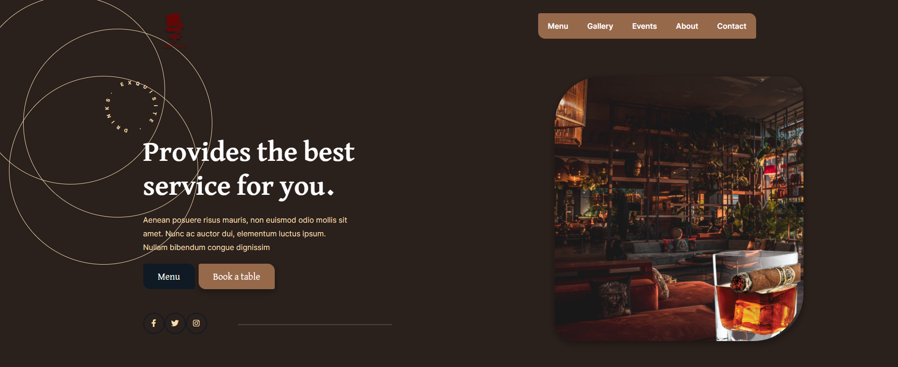

# Lounge-React-Bootstrap. - https://davidvida1.github.io/Lounge/

## 📝 Rough Resume

The Lounge website is a static page created by following a tutorial aimed at beginner front-end web developers. The purpose of this project was to learn Bootstrap and familiarize myself with CSS, HTML, JavaScript, and Figma. This project provided hands-on experience in building a professional-looking webpage using modern web development tools and design practices.

### ⌨️ Technologies Used:

- React JS
- JavaScript
- HTML
- CSS
- Bootstrap
- Figma

## 🖍️What I Learned

Through the process of creating the Lounge website, I gained valuable insights and developed several key skills:

- **Bootstrap Framework**: Learned how to use Bootstrap to quickly design responsive and visually appealing web pages with minimal custom CSS.
- **CSS Styling**: Gained a deeper understanding of CSS for styling elements, managing layouts, and improving the overall look and feel of the website.
- **HTML Structure**: Enhanced my knowledge of HTML to create well-structured and semantically meaningful web pages.
- **JavaScript Integration**: Integrated JavaScript for interactive features and dynamic content on the web page.
- **Responsive Design**: Applied responsive design principles to ensure the website looks good on devices of all sizes, from mobile phones to desktops.
- **Figma for Design**: Learned to use Figma for creating wireframes and design prototypes, improving my ability to plan and execute web designs before coding.

This project served as an excellent introduction to using Bootstrap in conjunction with React and other web technologies, laying a solid foundation for future web development projects.

## 📷Preview

